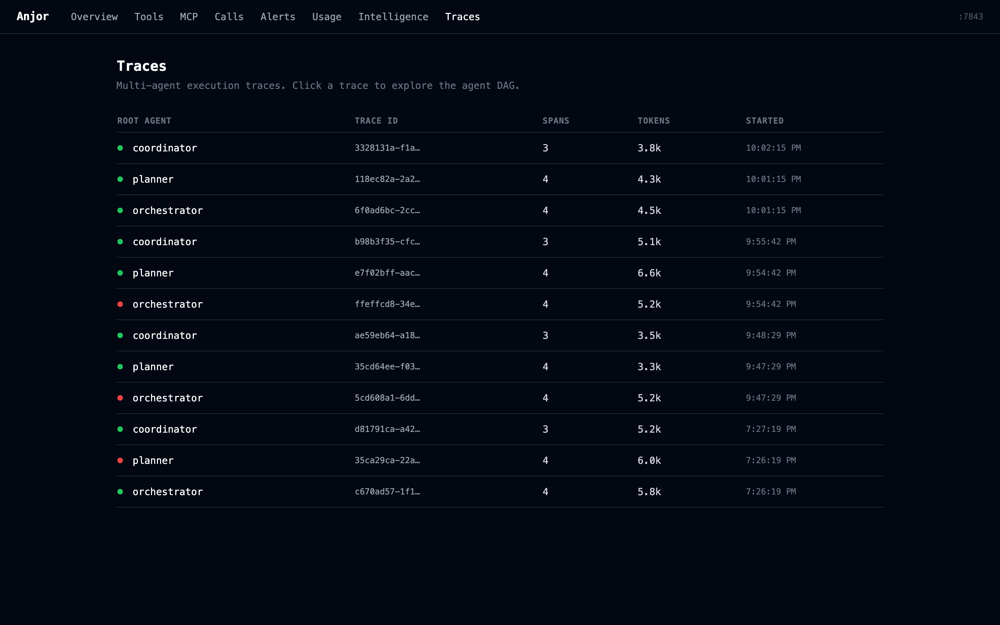

# Anjor

[](https://github.com/anjor-labs/anjor/actions/workflows/ci.yml)
[](https://github.com/anjor-labs/anjor)
[](https://pypi.org/project/anjor/)
[](https://www.python.org/downloads/)
[](LICENSE)

AI agents fail silently. A tool times out, a schema drifts, the context window fills up — and you find out from a user complaint, not a dashboard.

Anjor fixes that. It gives you full visibility into every LLM call, tool use, and MCP server interaction — latency, token usage, context window growth, schema drift, prompt changes — without changing a single line of your agent code. Beyond passive logging, it surfaces actionable analysis: failure pattern clustering, token optimization suggestions, and per-tool quality scores (A–F).

One-line install. No cloud. No account required.

---

## Dashboard


*Platform-wide summary: tool health, LLM cost by model, MCP server status, top failure patterns, and drift alerts at a glance.*

<details>
<summary>More screenshots</summary>

**LLM Usage** — token consumption and cost by model with daily trend and cache savings


**MCP Servers** — per-server call volume, success rates, and tool breakdown


**Intelligence** — failure clusters, token optimization opportunities, and quality scores


**Tools** — latency percentiles, drift detection, and per-tool drill-down


**Traces** — multi-agent span trees and cross-agent attribution



</details>

---

## Install

**Recommended (macOS / Homebrew Python):**
```bash
brew install pipx && pipx ensurepath
pipx install anjor           # collector + dashboard + CLI
pipx install "anjor[mcp]"    # add MCP server support (Claude Code / Gemini CLI)
```
Then open a new terminal tab so `$PATH` picks up the new command.

**Or with pip (inside a virtualenv):**
```bash
pip install anjor
pip install "anjor[mcp]"
```

> **Note:** `anjor watch-transcripts` and `anjor mcp` require v0.8.0+. `anjor status` requires v0.9.0+.

---

## Quickstart

### Tracking Claude Code (or Gemini CLI)

Best for users of Claude Code or Gemini CLI who want a visual dashboard of their sessions. No changes to your workflow needed.

#### Option A: Via MCP (recommended — auto-starts with Claude Code)

Add to `.mcp.json` in your project root (or `~/.claude/.mcp.json` for global):

```json
{
  "mcpServers": {
    "anjor": {
      "command": "anjor",
      "args": ["mcp", "--watch-transcripts"]
    }
  }
}
```

Anjor auto-starts the collector, ingests your Claude Code session transcripts, and exposes `anjor_status` as a tool Claude Code can call mid-session. It returns a time-windowed summary with actionable insights — failure rates, context utilisation, estimated cost — silently suppressed when everything is healthy.

For Gemini CLI, add to `.gemini/settings.json` (or `~/.gemini/settings.json`):

```json
{
  "mcpServers": {
    "anjor": {
      "command": "anjor",
      "args": ["mcp", "--watch-transcripts", "--providers", "gemini"]
    }
  }
}
```

#### Option B: Standalone (no MCP required)

```bash
anjor start --watch-transcripts
```

One command starts the collector, dashboard, and transcript watcher together. Open `http://localhost:7843/ui/` to see your sessions.

To watch specific agents or adjust the polling interval:
```bash
anjor start --watch-transcripts --providers claude,gemini --poll-interval 5.0
```

Run `anjor watch-transcripts --list-providers` to see which agents are detected on your machine.

#### Terminal health check (no browser needed)

```bash
anjor status                          # last 2h summary
anjor status --since-minutes 30       # last 30 minutes
anjor status --project myapp          # filter to a specific project
```

Prints a compact one-line summary with any actionable warnings below it:

```
last 2h: 47 calls · 6% failure · $0.08 · 74% ctx
⚠  web_search has a 30% failure rate (3/10 calls)
⚠  Context at 74%
```

Silent when everything is healthy. Exits with code 2 if the collector is not running.

---

### Alerting and Budgeting

Configure threshold alerts in `.anjor.toml` — Anjor fires a webhook whenever a condition is breached. Silent by default; you only hear from it when something matters.

```toml
[[alerts]]
name = "high_failure_rate"
condition = "failure_rate > 0.20"
window_calls = 10                            # rolling window of last N tool calls
webhook = "https://hooks.slack.com/services/..."

[[alerts]]
name = "context_warning"
condition = "context_utilisation > 0.80"
webhook = "https://hooks.slack.com/services/..."

[[alerts]]
name = "daily_budget"
condition = "daily_cost_usd > 5.00"
webhook = "https://example.com/webhook"
```

**Supported conditions:**

| Condition | Triggers on |
|-----------|-------------|
| `failure_rate > N` | Rolling window of tool calls exceeds N (0–1) |
| `p95_latency > N` | p95 latency in rolling window exceeds N ms |
| `context_utilisation > N` | Any LLM call where context used exceeds N (0–1) |
| `daily_cost_usd > N` | Cumulative estimated cost today exceeds $N |
| `session_cost_usd > N` | Cumulative cost since collector start exceeds $N |
| `error_type == "timeout"` | Tool call fails with the specified error type |

Webhook payload:
```json
{"alert": "daily_budget", "value": 5.21, "threshold": 5.00, "timestamp": "2026-04-17T..."}
```

When the URL contains `hooks.slack.com`, the payload is auto-formatted as `{"text": "anjor alert: ..."}` for Slack compatibility.

---

### Tracking Your Own Agent (API Patching)

Best for developers building custom AI agents who want real-time telemetry.

**1. Start the collector and dashboard:**
```bash
anjor start
```

**2. Patch your agent (one line):**
```python
import anjor
anjor.patch()  # instrument httpx automatically

import anthropic
client = anthropic.Anthropic()
# All calls are now captured — no other changes needed.
```

---

## What it captures

| Signal | Details |
|--------|---------|
| Tool calls | Name, status (success/failure), failure type, latency |
| MCP servers | Per-server call volume, success rate, latency — parsed from `mcp__server__tool` naming |
| Schema fingerprints | SHA-256 structural hash of tool input/output shape |
| Schema drift | Field-level diff against the baseline for each tool |
| LLM calls | Model, latency, finish reason — Anthropic, OpenAI, and Gemini |
| Token usage | Input + output + cache_read + cache_write tokens per call |
| Context window | Tokens used vs model limit, utilisation %, per-trace growth |
| Cache savings | Prompt cache hit rate and estimated cost savings |
| Context hogs | Per-tool average output size, % of context consumed |
| System prompt drift | SHA-256 per agent — alerts when prompt changes between calls |
| Failure patterns | Clustered failure analysis with descriptions and fix suggestions |
| Token optimization | Tools consuming >5% of context window, cost savings estimates |
| Quality scores | Per-tool reliability/schema-stability/latency grade (A–F) |
| Run quality | Per-trace context efficiency, failure recovery, diversity grade |
| Multi-agent spans | Parent/child span linking across agent boundaries |
| Trace graphs | DAG reconstruction, topological order, cycle detection |
| Cross-agent attribution | Token usage and failure rate broken down per agent |

---

## Supported providers

| Provider | SDK | Intercepted endpoint |
|----------|-----|----------------------|
| Anthropic | `anthropic` | `api.anthropic.com/v1/messages` |
| OpenAI | `openai` | `api.openai.com/v1/chat/completions` |
| Google Gemini | `google-generativeai` | `generativelanguage.googleapis.com/.../generateContent` |

All three providers are auto-detected — no configuration required.

---

## AI Coding Agents (Transcript Watchers)

Anjor can ingest and visualize history from agents that write local session transcripts. It acts as a post-hoc observatory even for agents you didn't build.

| Agent | Source tag | Discovery path | MCP support |
|-------|-----------|----------------|-------------|
| **Claude Code** | `claude_code` | `~/.claude/projects/**/*.jsonl` | Yes — `.mcp.json` |
| **Gemini CLI** | `gemini_cli` | `~/.gemini/tmp/**/*.json` | Yes — `.gemini/settings.json` |
| **OpenAI Codex** | `openai_codex` | `~/.codex/sessions/**/*.jsonl` | Coming soon |
| **AntiGravity** | `antigravity` | `~/.antigravity/**/*.jsonl` | Coming soon |

### One-shot ingestion
```bash
anjor watch-transcripts --providers claude,gemini   # specific agents
anjor watch-transcripts                             # auto-detect all
```

### Real-time watching (standalone)
Keep the watcher running in the background — it polls every 2 seconds:
```bash
anjor watch-transcripts --providers claude          # Claude Code sessions
anjor watch-transcripts --poll-interval 5.0         # custom interval
```

Or use `anjor start --watch-transcripts` to run the collector and watcher together in one process.

### List detected agents
```bash
anjor watch-transcripts --list-providers
```

---

## MCP Server Support

MCP tools are automatically identified by their naming convention — no extra configuration needed. Any tool whose name follows `mcp__<server>__<tool>` is grouped by server in the MCP dashboard:

```
mcp__github__create_pull_request   →  server: github,     tool: create_pull_request
mcp__filesystem__read_file         →  server: filesystem, tool: read_file
mcp__brave_search__web_search      →  server: brave_search, tool: web_search
```

The `/mcp` endpoint returns per-server and per-tool aggregates and supports a `?days=N` filter.

---

## API endpoints

| Method | Path | Description |
|--------|------|-------------|
| POST | `/events` | Ingest a tool/LLM/span event |
| POST | `/flush` | Force-flush pending batch writes; returns `{"flushed": N}` |
| GET | `/tools` | All tools with summary stats (`?since_minutes=N`, `?project=`) |
| GET | `/tools/{name}` | Tool detail (latency percentiles, drift) (`?since_minutes=N`) |
| GET | `/mcp` | MCP server and tool aggregates (`?days=N`) |
| GET | `/llm` | LLM call summary by model (`?days=N`, `?since_minutes=N`, `?project=`) |
| GET | `/llm/usage/daily` | Daily token usage by model (`?days=N`) |
| GET | `/calls` | Paginated raw event log |
| GET | `/traces` | Trace list (newest first) |
| GET | `/traces/{id}/graph` | DAG graph for a single trace |
| GET | `/health` | Uptime, queue depth, db path |
| GET | `/intelligence/failures` | Failure clusters sorted by rate |
| GET | `/intelligence/optimization` | Token hog tools + savings estimates |
| GET | `/intelligence/quality/tools` | Per-tool quality scores + grade |
| GET | `/intelligence/quality/runs` | Per-trace run quality scores + grade |
| GET | `/intelligence/attribution` | Per-agent token and failure attribution |

---

## Configuration

Via environment variables:

```bash
ANJOR_DB_PATH=./my_project.db python my_agent.py
ANJOR_BATCH_SIZE=1 ANJOR_BATCH_INTERVAL_MS=100 python my_agent.py
ANJOR_LOG_LEVEL=DEBUG python my_agent.py
```

Via `.anjor.toml` in your project root:

```toml
db_path = "my_project.db"
batch_size = 10
batch_interval_ms = 200
log_level = "DEBUG"
```

Via code:

```python
import anjor
from anjor.core.config import AnjorConfig

anjor.patch(config=AnjorConfig(db_path="my_project.db", batch_size=1))
```

---

## Programmatic Access

Query your agent's history directly from Python — no running collector required:

```python
import anjor
from anjor.models import ToolSummary, FailurePattern, ToolQualityScore

with anjor.Client("anjor.db") as client:
    # Per-tool summary stats
    for tool in client.tools():
        print(f"{tool.tool_name:30s}  calls={tool.call_count}  ok={tool.success_rate:.0%}")

    # Single tool detail (latency percentiles)
    t = client.tool("web_search")
    if t:
        print(f"p95={t.p95_latency_ms:.0f}ms  p99={t.p99_latency_ms:.0f}ms")

    # Raw call records (filterable)
    failures = client.calls(status="failure", limit=20)

    # Intelligence layer
    patterns  = client.intelligence.failures()      # list[FailurePattern]
    quality   = client.intelligence.quality()       # list[ToolQualityScore]
    runs      = client.intelligence.run_quality()   # list[RunQualityScore]
    opts      = client.intelligence.optimization()  # list[OptimizationSuggestion]
```

All return types are frozen Pydantic models importable from `anjor.models`:

```python
from anjor.models import (
    ToolSummary,
    ToolCallRecord,
    FailurePattern,
    OptimizationSuggestion,
    ToolQualityScore,
    RunQualityScore,
)
```

The `Client` reads SQLite directly — no HTTP calls, no collector process needed.
It opens the connection lazily on first query and is safe to use as a context manager.

---

## Limitations

- **Streaming calls** — captured only when the response stream is fully consumed. If your agent reads the stream partially or exits early (e.g. stops iterating a generator before the final chunk), that call is not recorded.
- **Quality scores** — computed from three measurable signals: reliability (failure rate), schema stability (drift rate), and latency consistency (coefficient of variation). They use fixed weights, not ML. They surface patterns worth investigating; they don't identify root causes.
- **Cost estimates** — the price table in the dashboard is maintained manually and will drift as providers update their pricing. Token counts from transcripts are exact; dollar figures are approximate.
- **No cloud sync, authentication, or team features** — Anjor is local-only. All data stays on your machine.

---

## Development

```bash
git clone https://github.com/anjor-labs/anjor.git
cd anjor
pip install -e ".[dev]"
pytest --cov=anjor --cov-fail-under=95 -q
ruff check anjor/ tests/
mypy anjor/
anjor start
```

See [CONTRIBUTING.md](CONTRIBUTING.md) for full guidelines.

---

## Documentation

- [Quickstart — see it in action](docs/quickstart.md)
- [Architecture — layer diagram and design decisions](docs/architecture.md)

---

## Contributing & Contact

- **Bug reports / feature requests** — [open an issue](https://github.com/anjor-labs/anjor/issues)
- **Questions / ideas** — [start a discussion](https://github.com/anjor-labs/anjor/discussions)

## License

[MIT](LICENSE) © Anjor Labs
