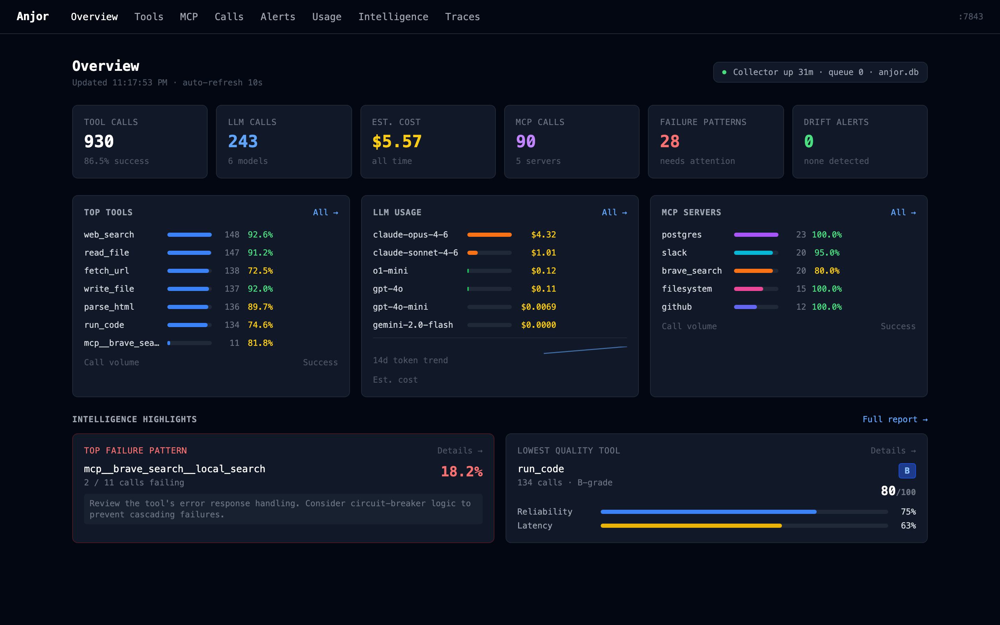
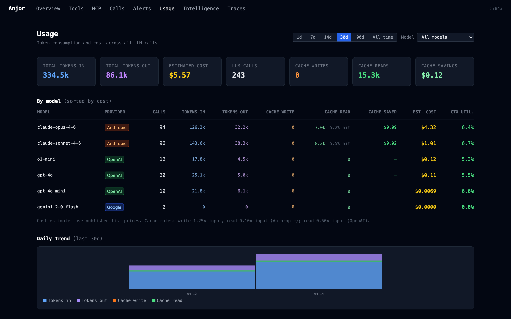
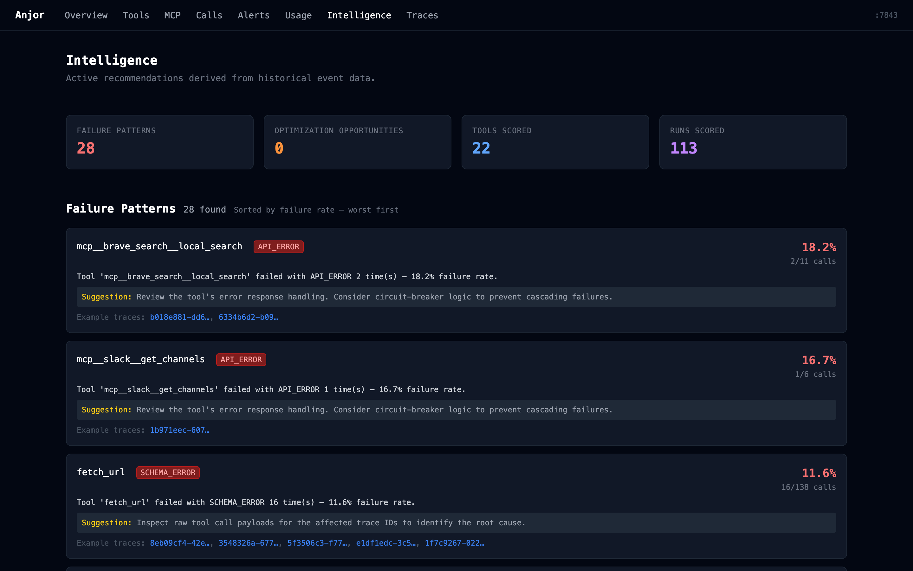
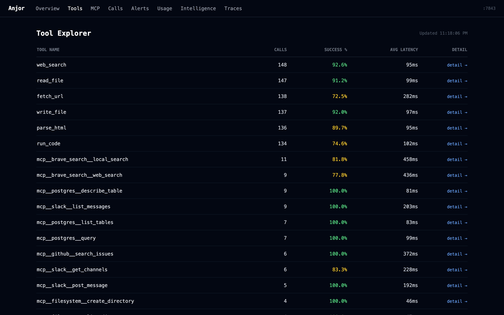
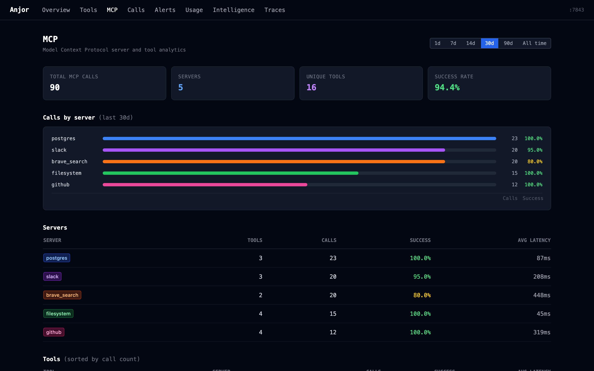

# Anjor

[](https://github.com/anjor-labs/anjor/actions/workflows/ci.yml)
[](https://pypi.org/project/anjor/)
[](https://www.python.org/downloads/)
[](LICENSE)

**Zero-instrumentation observability for AI agents.** See every tool call, LLM cost, context window, and failure — without touching your agent code.



<details>
<summary>More screenshots — LLM usage, session replay, intelligence, tools</summary>

**Session Replay** — browse every conversation turn, tool result, and assistant response



**Intelligence** — failure clusters, root cause hypotheses, token optimization, quality grades



**Tools** — latency percentiles, drift detection, per-tool drill-down



**MCP Servers** — per-server call volume, success rates, tool breakdown



</details>

---

## What you get

- **Dashboard at `:7843/ui/`** — tool health, LLM cost by model, MCP servers, failure patterns, session replay
- **Zero code changes** — `anjor.patch()` instruments httpx automatically; transcript watchers read Claude Code / Gemini CLI / Codex sessions passively
- **Terminal health check** — `anjor status` prints a one-line summary with warnings; silent when healthy
- **CI quality gates** — `anjor report --assert "success_rate >= 0.95"` exits non-zero on regression
- **Intelligence layer** — failure clusters, root cause hypotheses, token hog detection, A–F quality grades

---

## Install

```bash
pipx install "anjor[mcp]"
```

> Requires Python 3.11+. `pipx` keeps Anjor isolated from your project's dependencies.
> [Full install options →](docs/installation.md)

---

## Quickstart

### If you use Claude Code, Gemini CLI, or Codex

Add to `.mcp.json` in your project root (Claude Code picks this up automatically):

```json
{
  "mcpServers": {
    "anjor": {
      "command": "anjor",
      "args": ["mcp", "--watch-transcripts"]
    }
  }
}
```

Anjor starts automatically with Claude Code, ingests your session transcripts, and adds `anjor_status` as a tool Claude can call to check its own health mid-session. Open `http://localhost:7843/ui/` to see your dashboard.

**Or start manually** (no MCP required):

```bash
anjor start --watch-transcripts
```

---

### If you're building your own agent

**1. Start the collector:**
```bash
anjor start
```

**2. Add one line to your agent:**
```python
import anjor
anjor.patch()                     # instruments httpx — no other changes needed

import anthropic
client = anthropic.Anthropic()
response = client.messages.create(...)   # captured automatically
```

**3. Open the dashboard:** `http://localhost:7843/ui/`

**JavaScript / TypeScript agents:**
```ts
import { anjor } from '@anjor-labs/sdk'

const a = anjor({ collectorUrl: 'http://localhost:7843' })
const result = await a.traceTool('web_search', () => searchTool(query))
const resp   = await a.traceCall('openai', () => openai.chat.completions.create(...))
```

---

### Terminal health check

```bash
anjor status
```

```
last 2h: 47 calls · 6% failure · $0.08 · 74% ctx
⚠  web_search has a 30% failure rate (3/10 calls)
⚠  Context at 74%
```

Silent when everything is healthy. Exits with code 2 if the collector isn't running.

---

## Essential config

Create `.anjor.toml` in your project root to override defaults:

```toml
# Store data in a project-specific DB instead of the shared ~/.anjor/anjor.db
db_path = "my_project.db"

# Disable conversation capture (on by default; first 500 chars stored locally)
# capture_messages = false

# Export spans to Jaeger, Grafana Tempo, or Datadog Agent
[export]
otlp_endpoint = "http://localhost:4318"
```

---

## Detailed guides

| Guide | What's inside |
|-------|--------------|
| [Installation](docs/installation.md) | pipx, pip, virtualenv options |
| [Configuration](docs/configuration.md) | Full `.anjor.toml` reference, env vars, all defaults |
| [CLI reference](docs/cli-reference.md) | `start`, `status`, `report`, `diff`, `summarize`, `mcp`, `watch-transcripts` |
| [API reference](docs/api-reference.md) | All REST endpoints with parameters |
| [Alerting & budgeting](docs/alerting.md) | Webhook setup, Slack integration, all alert conditions |
| [Intelligence features](docs/intelligence.md) | Root cause advisor, failure clusters, quality grades, prompt tracking |
| [`@anjor-labs/sdk`](docs/sdk.md) | JavaScript/TypeScript SDK — `traceTool`, `traceCall`, token extraction |
| [Providers & watchers](docs/providers.md) | Supported LLM SDKs and transcript agents |
| [Architecture](docs/architecture.md) | Layer diagram and design decisions |

---

## Limitations

- **Streaming** — captured only when the stream is fully consumed.
- **Cost estimates** — price table is maintained manually; token counts are exact, dollar figures are approximate.
- **Quality scores** — based on measurable signals (failure rate, schema drift, latency variance), not ML. Surface patterns worth investigating, not root causes.
- **Local only** — no cloud sync, no accounts, no data egress.

---

## Contributing

```bash
git clone https://github.com/anjor-labs/anjor.git
cd anjor && pip install -e ".[dev]"
pytest --cov=anjor --cov-fail-under=95 -q
```

[Open an issue](https://github.com/anjor-labs/anjor/issues) · [Start a discussion](https://github.com/anjor-labs/anjor/discussions)

---

[MIT](LICENSE) © Anjor Labs
